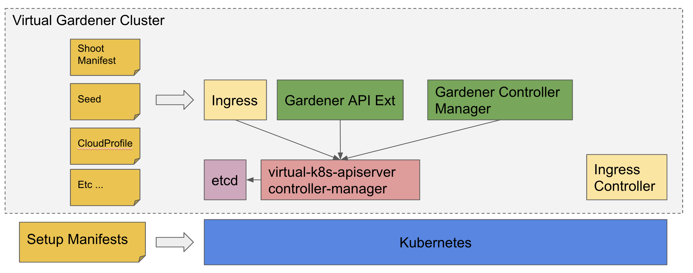

# Gardener-GKE

_Disclaimer: This project sets up a Gardener landscape on a GKE cluster. This is by no means a productive setup!_

## Overview



## Prerequisites

* Kubernetes cluster
* Domain/Zone in CloudDNS
* GCP serviceaccount
* terraform
* yaml2json https://github.com/bronze1man/yaml2json
* jq
* cfssl
* openssl
* kubectl
* helm

## Setup

### Prepare setup.yaml

First we need to clone and configure our setup

```bash
git clone https://github.com/afritzler/virtual-gardener-gke.git
cd virtual-gardener-gke
cp setup.yaml.example setup.yaml
```

You will need a `kubeconfig` with basic-auth user authentication.

```bash
export KUBECONFIG=/tmp/kubeconfig
gcloud container clusters get-credentials CLUSTER_NAME --zone europe-west1-b --project PROJECT_NAME
src/bin/convertkubeconfig
```

Then, edit the `setup.yaml` accordingly.

### Deploy Ingress Controller + Ingress DNS Record

```bash
src/ingress-controller/deploy
```

### Deploy Etcd

Deploy the Etcd needed by the Gardener extension API server

```bash
src/etcd/deploy
```

### Deploy Identity

```bash
src/identity/deploy
```

### Deploy Virtual Kube-Apiserver

```bash
src/virtualapiserver/deploy
```

### Deploy Gardener

Deploy the Gardener extension API server and controller

```bash
src/gardener/deploy
```

### Configure the Gardener Landscape

Deploy and configure CloudProfile, Seed, etc ...

```bash
src/gardenconfig/deploy
```

### Deploy the Gardener Dashboard

```bash
src/dashboard/deploy
```

### Accessing the Gardener Dashboard

To access the Gardener Dashboard, use

```bash
cat state/identity/dashboardurl
```

to figure out the dashboard URL.

### Interacting with the Virtual Setup

The `kubeconfig` can be found under `state/virtualapiserver/kubeconfig.yaml`. So in order to deploy something to the Gardener API server you need to run

```bash
kubectl --kubeconfig=state/virtualapiserver/kubeconfig.yaml apply -f examples/shoot.yaml
```

## Cleanup

### Remove Shoot

Delete the created shoot cluster (a simple kubectl delete shoot NAME is not allowed in order to prevent users from accidentally deleting their clusters – instead, they need to confirm upfront that the deletion is fine by annotating the shoot resource. You can use this script to do that: https://github.com/gardener/gardener/blob/master/hack/delete (./hack/delete shoot gcp-test garden-core)).

To do it the manual way

```bash
kubectl --kubeconfig=state/virtualapiserver/kubeconfig.yaml -n garden-core annotate shoot gcp-test confirmation.garden.sapcloud.io/deletion=true --overwrite
kubectl --kubeconfig=state/virtualapiserver/kubeconfig.yaml -n garden-core delete shoot gcp-test
```

### Remove Gardener Config

```bash
kubectl --kubeconfig state/virtualapiserver/kubeconfig.yaml annotate project core confirmation.garden.sapcloud.io/deletion=true --overwrite
kubectl --kubeconfig state/virtualapiserver/kubeconfig.yaml delete -f gen/gardenconfig/config.yaml
```

### Remove Gardener

```bash
helm delete --purge gardener
```

### Remove Virtual API Server

```bash
helm delete --purge virtual-apiserver
```

### Remove Identity

```bash
helm delete --purge identity
```

### Remove Gardener Dashboard

```bash
helm delete --purge gardener-dashboard
```

### Remove Etcd

```bash
helm delete --purge virtual-garden-etcd
```

### Remove Ingress Controller + DNS Record

```bash
helm delete --purge nginx-ingress-controller
# to delete the DNS record
./src/ingress-controller/destroy
```

### Remove the Garden Namespace

```bash
kubectl delete ns garden
```